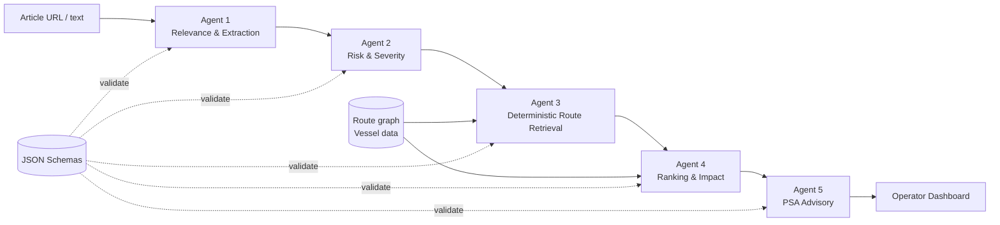

# PSA Sentinel

PSA Sentinel is an agentic maritime risk decision-support prototype built for the PSA Code Sprint. It turns external maritime intelligence into terminal-operational insight: determine whether an event matters to a PSA-linked corridor, assess route exposure, retrieve known alternatives, calculate schedule impact, and recommend actions that remain within PSA's control.

> **External disruption → route exposure → schedule impact → PSA operational action**

The MVP follows one vessel on the Rotterdam → PSA Singapore corridor. It combines Gemini-based interpretation with deterministic route retrieval and ETA calculations, then presents the result on a live operator dashboard.

## The problem

Geopolitical conflict, chokepoint disruption, attacks on commercial shipping, port strikes, severe weather, trade restrictions, and carrier rerouting can change vessel arrivals long before a vessel reaches Singapore.

For PSA, knowing that an incident happened is only the start. Operators need to understand:

- whether a scheduled corridor is exposed;
- which known alternatives a carrier or vessel operator may use;
- how the arrival schedule may change; and
- what berth, crane, manpower, yard, and transshipment plans may need adjustment.

## Our solution

PSA Sentinel processes one submitted news article through five specialised agents:

```text
News / Maritime Intelligence
        → Relevance
        → Risk Assessment
        → Route Exposure & Alternatives
        → ETA / Operational Impact
        → PSA Advisory
```

This is not a generic news summariser. LLMs interpret evidence and explain results; deterministic code owns route lookup, scoring inputs, ranks, and ETA mathematics.

## Agentic pipeline

| Agent | Purpose and input | What it produces | Implementation choice |
| --- | --- | --- | --- |
| **1 — Relevance & Extraction** | Fetches the submitted URL, extracts readable article text, and determines whether it could affect PSA-bound maritime shipping. | A validated `Event`: relevance and confidence, rationale, summary, entities, canonical chokepoints, and verbatim evidence excerpts. | **Gemini Flash + Trafilatura.** Interpretation is useful here, but output is constrained by `event.schema.json`. An irrelevant event ends the pipeline cleanly. |
| **2 — Risk & Severity** | Consumes only Agent 1's validated event and assesses material transit disruption. | A validated `RiskAssessment`: severity, probability, confidence, affected chokepoints, duration, rationale, and evidence copied from Agent 1. | **Gemini Flash with deterministic checks.** Agent 2 cannot introduce a chokepoint or evidence item Agent 1 did not identify. |
| **3 — Deterministic Route Retrieval** | Consumes the accumulated run and queries the static route graph for exposure and alternatives. | Validated references to baseline and viable candidate route IDs, with retrieval reasons. | **No LLM.** It performs reproducible graph lookup and never invents a shipping route. |
| **4 — Ranking & Operational Impact** | Joins candidate IDs to route and vessel data, scores candidates, and calculates arrival impact. | Validated ranked routes containing score, rank, revised ETA, ETA delta, and rationale. | **Deterministic score/rank/ETA; Gemini Flash for wording only.** Gemini explains supplied numbers and cannot change them. |
| **5 — Advisory & Recommendation** | Consumes the complete validated event, risk, candidate, and ranking state. | A PSA-facing headline, summary, 2–4 recommended actions, derived confidence, and pending operator decision. | **Gemini Flash for synthesis.** Advice is restricted to PSA-controlled terminal operations. |

### Agent 1 — Relevance & Extraction

Agent 1 uses Trafilatura to fetch and extract an article, then asks Gemini for structured output. Evidence must be short verbatim excerpts from the supplied article. Chokepoint names are canonicalised against the project taxonomy; broad regions such as the Red Sea or Indian Ocean are not treated as chokepoints.

If URL extraction fails, the run enters `awaiting_manual_text`. The backend can resume the same run through `POST /runs/{run_id}/article-text`. The current dashboard does not yet expose that manual-text input, so it is an API-level fallback.

### Agent 2 — Risk & Severity

Agent 2 distinguishes:

- **severity** — Low, Medium, High, or Critical;
- **probability** — likelihood of material transit disruption; and
- **confidence** — confidence in the assessment itself.

The taxonomy recognises Strait of Hormuz, Bab el-Mandeb, Suez Canal, and Strait of Malacca. The MVP graph represents Suez Canal, Bab el-Mandeb, and Strait of Malacca; a recognised chokepoint outside that graph is reported as unsupported rather than converted into an invented route.

### Agent 3 — Deterministic Route Retrieval

Agent 3 loads `backend/data/route_graph.json` and `backend/data/vessel.json`, validates them, and uses the vessel's scheduled route as the baseline. If an affected graph-supported chokepoint traverses the baseline, it retains that route for comparison and returns same-corridor graph alternatives that avoid it.

Current route knowledge:

- **`RT-001-BASELINE`** — Rotterdam → Mediterranean Sea → Suez Canal → Red Sea → Bab el-Mandeb → Indian Ocean → Strait of Malacca → PSA Singapore; 8,300 nm and 24 base transit days.
- **`RT-002-CAPE-BYPASS`** — Rotterdam → Atlantic Ocean → Cape of Good Hope → Indian Ocean → Strait of Malacca → PSA Singapore; 11,700 nm and 34 base transit days.

This boundary is deliberate: deterministic retrieval is auditable, reproducible, and prevents hallucinated maritime routes.

### Agent 4 — Ranking & Operational Impact

Agent 4 calculates each candidate's score from:

- **75% route-risk score** — exposed routes are penalised using disruption probability and a fixed severity factor;
- **15% transit score** — shorter candidate transit time scores higher; and
- **10% distance score** — shorter candidate distance scores higher.

Routes are sorted by descending score, then ETA delta and route ID for deterministic tie-breaking. ETA impact is also deterministic:

```text
ETA delta = candidate base transit days − baseline base transit days
Revised ETA = scheduled vessel arrival + ETA delta
```

For the current Cape bypass data, `34 − 24 = +10 days`. That value comes from route data and Agent 4—not the article or Agent 5. Gemini contributes only concise route rationale after calculation.

### Agent 5 — Advisory & Recommendation

Agent 5 translates upstream results into actions a PSA planner can own, such as:

- monitor vessel trajectory and revised ETA;
- replan berth windows and quay-crane deployment;
- adjust terminal manpower or gang scheduling;
- prepare yard capacity and vessel-bunching contingencies;
- review transshipment connections; and
- coordinate revised port-call timing with the carrier.

PSA Sentinel does **not** tell PSA to change vessel navigation, routing, or speed. Those decisions belong to the vessel master, shipping line, or carrier. Agent 5 treats the selected route as an external operator decision and focuses on its terminal consequences.

## Why this is agentic

PSA Sentinel is more than one large prompt:

- each agent has one specialised responsibility;
- every stage consumes validated upstream output;
- the shared run state accumulates explicit, inspectable artefacts;
- deterministic tools replace generation where correctness matters;
- state is persisted after every transition;
- malformed output halts the pipeline instead of silently propagating; and
- the UI exposes agent progress and the resulting audit trail.

Conceptually:

```text
Article
  → Agent 1 confirms maritime relevance and extracts evidence
  → Agent 2 identifies Bab el-Mandeb risk
  → Agent 3 retrieves the predefined Cape alternative
  → Agent 4 ranks it and calculates the +10-day demo impact
  → Agent 5 recommends terminal-side preparation
```

The `+10 days` result is specific to the current deterministic demo routes.

## Demo scenario

The flagship MVP scenario follows **MV Pacific Voyager** from **Rotterdam to PSA Singapore**.

**Scheduled corridor**

```text
Rotterdam → Suez Canal → Red Sea → Bab el-Mandeb
          → Indian Ocean → Strait of Malacca → PSA Singapore
```

**Disruption:** Bab el-Mandeb / Red Sea security conditions make the scheduled corridor operationally exposed.

**Graph alternative:** `RT-002-CAPE-BYPASS` travels around the Cape of Good Hope before crossing the Indian Ocean to Malacca and Singapore.

This scenario is useful because baseline exposure is visible, the alternative is intuitive, and its longer transit translates directly into berth, resource, yard, and transshipment planning consequences.

The information lineage is explicit:

| Stage | Source of truth |
| --- | --- |
| Incident facts and excerpts | Submitted article, extracted by Agent 1 |
| Severity, probability, and affected chokepoint | Agent 2 assessment of Agent 1's validated evidence |
| Baseline and Cape route knowledge | Static route graph queried by Agent 3 |
| Rank, score, revised ETA, and ETA delta | Agent 4 deterministic calculation |
| PSA operational response | Agent 5 synthesis of the validated accumulated state |

## System architecture



- **Frontend:** React single-page dashboard built with Vite. MapLibre renders the corridor, selected route, and risk marker. An SSE client follows pipeline status and refreshes accumulated run data.
- **API:** FastAPI creates runs, serves routes/vessel/history, streams status, accepts manual article text, and persists operator decisions.
- **Orchestrator:** a sequential five-stage state machine launched as a FastAPI background task. States are `queued → extracting → assessing_risk → retrieving_routes → ranking → advising → complete`, with explicit not-relevant, manual-text, and error outcomes.
- **Data:** checked-in JSON schemas, a two-route MVP graph, one mocked vessel, a chokepoint taxonomy, and local JSON run/event storage.
- **AI:** Google Gemini Flash is used by Agents 1, 2, 4, and 5. Agent 3 has no Gemini dependency.

## Shared state and schema validation

Agents communicate through an accumulated `Run`, not loose prose. The orchestrator adds these validated outputs in order:

```text
Run → Event → RiskAssessment → CandidateRoute[] → RankedRoute[] → Advisory
```

The Draft 7 schemas in `schemas/` reject extra fields and enforce required fields, types, enumerations, URI/date formats, and confidence bounds. Additional application checks enforce matching `run_id` values, known route references, canonical chokepoints, and evidence lineage.

If an agent fails or produces malformed output, the run becomes `error`; downstream outputs are not fabricated.

## Human in the loop

The dashboard supports this operator workflow:

1. Submit an article URL and optional note.
2. Watch all five agent cards transition through live states via SSE.
3. Review the event, risk severity/probability, candidate routes, ranking, revised ETA, and ETA delta.
4. Read Agent 5's advisory and expand upstream reasoning.
5. Accept or dismiss the advisory with an optional comment.
6. Reopen the persisted run and decision from History.

Accept/Dismiss decisions and comments are persisted and appended to the event log. “Request more detail” currently expands existing risk and route rationale; it does not launch another model call. Recommended-action checkboxes are presentation controls and are not persisted.

## Route map

Before a run, the map shows only the scheduled baseline. After Agent 3, candidate routes become visible. After Agent 4, the rank-1 route controls the selected high-visibility line, while the baseline remains muted/dashed for comparison. The vessel card and legend show the selected route, revised ETA, and ETA delta. Risk markers appear only for affected chokepoints represented by visible route data.

The route metrics and polylines are deterministic demo data. They are geographically illustrative, not navigation-grade routing and not live AIS positions.

## Auditability

Each transition is persisted to local JSON and appended to a timestamped system event log. A reviewer can trace:

- Agent 1's relevance decision, entities, and article evidence;
- Agent 2's risk assessment and affected chokepoints;
- Agent 3's exact graph route references and unsupported graph chokepoints;
- Agent 4's ranking, score, ETA, and route rationale;
- Agent 5's advisory, confidence, and actions; and
- the operator's final decision and comment.

The History view lists past runs and can reopen their complete state.

## Tech stack

| Layer | Current implementation |
| --- | --- |
| Frontend | React, JavaScript, Vite, MapLibre GL JS, Lucide React, CSS/Tailwind tooling |
| Backend | Python, FastAPI, Pydantic, Uvicorn |
| AI | Google Gen AI SDK with a configurable Gemini Flash model |
| Article extraction | Trafilatura |
| Contracts | JSON Schema Draft 7 via `jsonschema` |
| Realtime status | Server-Sent Events (SSE) |
| Persistence | Local JSON files under `backend/storage/` |
| Tests | Pytest, Vitest, React Testing Library |

There is no database, Supabase dependency, OpenAI API dependency, AIS feed, or external maritime-routing API in the current MVP.

## Project structure

```text
PSA-hackathon/
├── backend/
│   ├── agents/                 # Five agent implementations
│   ├── prompts/                # Gemini instructions and prompt builders
│   ├── orchestrator/           # State machine and schema validation
│   ├── data/                   # Route graph, vessel, chokepoint taxonomy
│   ├── storage/                # Local persisted runs and event logs
│   ├── config.py               # Gemini environment configuration
│   └── main.py                 # FastAPI REST/SSE endpoints
├── frontend/
│   ├── src/components/         # Map, pipeline, advisory, history, route UI
│   ├── src/lib/                # API client, SSE hook, route presentation
│   ├── src/Dashboard.jsx       # Main operator dashboard
│   └── package.json            # Vite scripts and dependencies
├── schemas/                    # Shared JSON pipeline contracts
├── tests/                      # Backend agent/orchestrator tests
├── SPEC.md                     # Product source of truth
└── README.md
```

## How to run locally

### Prerequisites

- Python 3.10 or newer
- Node.js `^20.19.0` or `>=22.12.0` (required by the installed Vite version)
- npm
- a Google Gemini API key
- internet access for article retrieval, Gemini calls, and map tiles

Docker and a database are not required.

### Environment variables

Copy the checked-in backend example:

```bash
cp backend/.env.example backend/.env
```

Then set:

```env
GEMINI_API_KEY=your_api_key
GEMINI_MODEL=gemini-3.6-flash
```

`GEMINI_API_KEY` is required. `GEMINI_MODEL` is optional but, when supplied, must name a Gemini Flash model. The backend reads `backend/.env` directly.

The frontend defaults to `http://localhost:8000`. To use another backend URL, create `frontend/.env.local`:

```env
VITE_API_BASE_URL=http://localhost:8000
```

### Backend

Run from the repository root:

```bash
python3 -m venv .venv
source .venv/bin/activate
python -m pip install -r backend/requirements.txt
uvicorn backend.main:app --reload
```

The API runs at `http://localhost:8000`; FastAPI documentation is at `http://localhost:8000/docs`.

### Frontend

In a second terminal:

```bash
cd frontend
npm install
npm run dev
```

Open `http://localhost:5173`.

### Run the tests

From the repository root with the Python environment activated:

```bash
python -m pytest -q
```

From `frontend/`:

```bash
npm test
npm run build
```

The frontend package does not currently define a lint script.

## API summary

| Method | Endpoint | Purpose |
| --- | --- | --- |
| `POST` | `/runs` | Create a run and start the pipeline in a background task |
| `GET` | `/runs/{run_id}` | Read accumulated run state |
| `GET` | `/runs/{run_id}/stream` | Stream status changes over SSE |
| `GET` | `/runs/{run_id}/events` | Read the run's audit events |
| `POST` | `/runs/{run_id}/article-text` | Resume an extraction-blocked run with manual text |
| `POST` | `/runs/{run_id}/decision` | Persist Accept/Dismiss and an optional comment |
| `GET` | `/runs` | List run summaries for History |
| `GET` | `/routes` | Read the deterministic route graph |
| `GET` | `/vessel` | Read the mocked vessel and schedule |

## Demo walkthrough

1. Open PSA Sentinel and introduce MV Pacific Voyager's scheduled Rotterdam → Suez → Bab el-Mandeb → Singapore baseline.
2. Paste a maritime-news URL about unsafe or disrupted Bab el-Mandeb / Red Sea transit.
3. Click **Start assessment** and point out the live five-agent status rail.
4. Explain that Agent 1 extracts article-backed facts and decides relevance.
5. Show Agent 2 identifying Bab el-Mandeb risk, severity, probability, and duration.
6. Emphasise that Agent 3 retrieves `RT-002-CAPE-BYPASS` from static route knowledge—it does not generate a route.
7. Show Agent 4 selecting and highlighting the rank-1 route and calculating the revised ETA and `+10 days` for this demo data.
8. Read Agent 5's terminal-side actions and connect them to berth, resources, yard, and transshipment planning.
9. Accept or dismiss the advisory with a comment, then show the persisted decision in History and the event log.

## Presentation cheat sheet

### 30-second pitch

PSA Sentinel turns external maritime disruption news into operational foresight for PSA. Five specialised agents verify relevance, assess chokepoint risk, retrieve only predefined maritime routes, calculate ETA impact, and recommend terminal-side actions. The result is explainable and auditable: operators can see what came from the article, what was calculated, and why a recommendation was made—while the human remains in control.

### What makes it different?

- It connects news to route exposure, schedule impact, and terminal action—not just a summary.
- Route retrieval is deterministic, so the model cannot hallucinate shipping paths.
- ETA, ranks, and scores are calculated before Gemini writes an explanation.
- Every stage has a validated contract and visible audit trail.
- PSA receives decision support; vessel navigation remains with the carrier and vessel operator.

### Key line to remember

> **PSA Sentinel does not decide how the vessel sails. It tells PSA how a global maritime disruption may affect the terminal and what operations need to change.**

### If judges ask: “Why five agents?”

Each stage has a different job and failure mode. Separating extraction, risk assessment, route retrieval, numerical impact, and advice makes intermediate results testable, schema-validatable, auditable, and easier to diagnose. It also lets route retrieval and ETA calculation remain deterministic.

### If judges ask: “Why not one Gemini prompt?”

One prompt would mix evidence extraction, risk judgement, route invention, calculations, and recommendations. The pipeline validates each hand-off, uses deterministic code where correctness matters, and reduces the chance that fluent text hides an unsupported route or number.

### If judges ask: “Is the route real-time?”

No. The MVP uses a predefined two-route graph and one mocked vessel schedule. Map geometry is static and illustrative. A production version could connect the same agent contracts to AIS, carrier schedule, network, weather, and port intelligence feeds.

## Current limitations and future work

Current MVP limitations:

- one Rotterdam → PSA Singapore corridor and one mocked vessel;
- a predefined two-route graph rather than a live carrier network;
- simplified ETA based on fixed base transit days, without weather, congestion, speed, or port-call modelling;
- no live AIS or carrier schedule integration;
- article extraction can fail on paywalls or inaccessible pages;
- manual-text recovery exists in the API but not yet in the dashboard;
- the optional operator note is submitted by the UI but is not yet used or persisted by the orchestrator;
- local JSON persistence is suitable for a demo, not concurrent production workloads;
- route polylines are illustrative rather than navigation-grade; and
- no automatic terminal-planning or carrier-system integration.

Credible next steps include AIS and carrier schedule feeds, weather and port-strike intelligence, a richer validated route network, durable database-backed audit storage, manual-text recovery in the UI, authentication/roles, and integrations with berth, yard, workforce, and transshipment planning systems.
